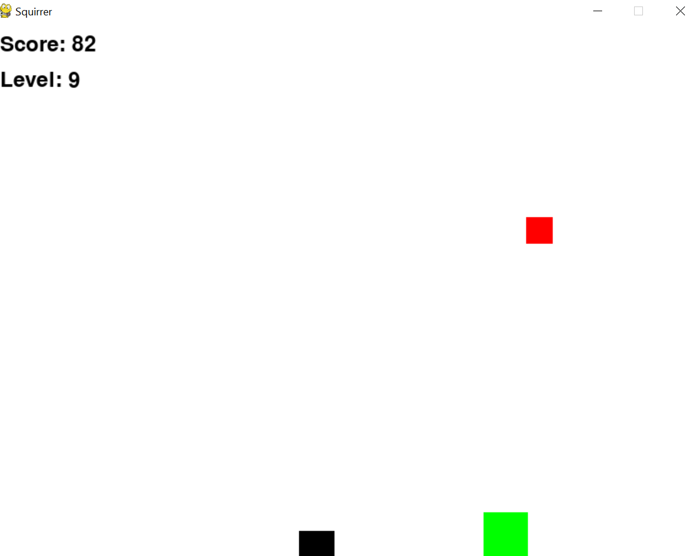
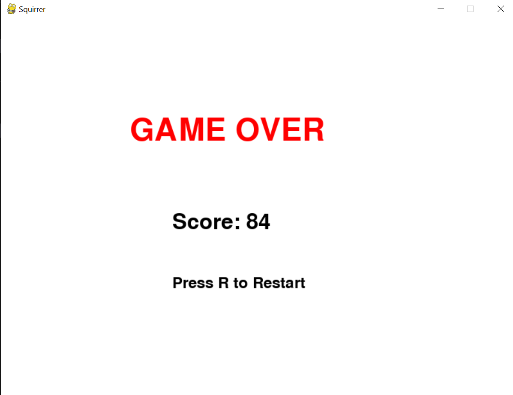

# Squirrer-Adventure

**Squirrer-Adventure** is a fun and engaging game developed using Python and Pygame. The objective of the game is to guide a squirrel to collect acorns while avoiding obstacles. The game increases in difficulty as the player progresses through levels.

## Features

- **Player Control:** Move the squirrel using arrow keys.
- **Collectibles:** Acorns that increase your score.
- **Obstacles:** Avoid them to prevent game over.
- **Levels:** The game becomes more challenging as you score more points.
- **Configurable:** Game settings like screen size and initial speed are configurable through a YAML file.

## Installation

1. **Clone the Repository:**


   ```bash
   git clone https://github.com/GebrecherkosAbrha/Squirrer-Adventure.git
   ```
2.  **Navigate to the Project Directory:**

   ```bash
       cd Squirrer-Adventure
   ```
3. **Set Up a Virtual Environment (Optional but recommended):**
   ```bash
   python -m venv venv
   ```
   - **Activate the Virtual Environment:**
     **On Windows:**

     ```bash
         venv\Scripts\activate
     ```
     **On macOS/Linux:**
          ```bash
         source venv/bin/activate
         ```

   4. **Install the Required Packages:**
   
    ```bash
     pip install pygame pyyaml
    ```
   5. **Run the Game:**
      ```bash
      python squirrer.py
      ```


### Gameplay


_The game in action while collecting acorns and avoiding obstacles._

### Game Over


_The screen displayed when the game ends. Press 'R' to restart the game._


### Usage
Use the arrow keys to move the squirrel. Collect acorns to increase your score and avoid obstacles to prevent game over. The game becomes more challenging as you progress through levels.

### Controls
Arrow Keys: Move the squirrel.
R Key: Restart the game after a game over.
